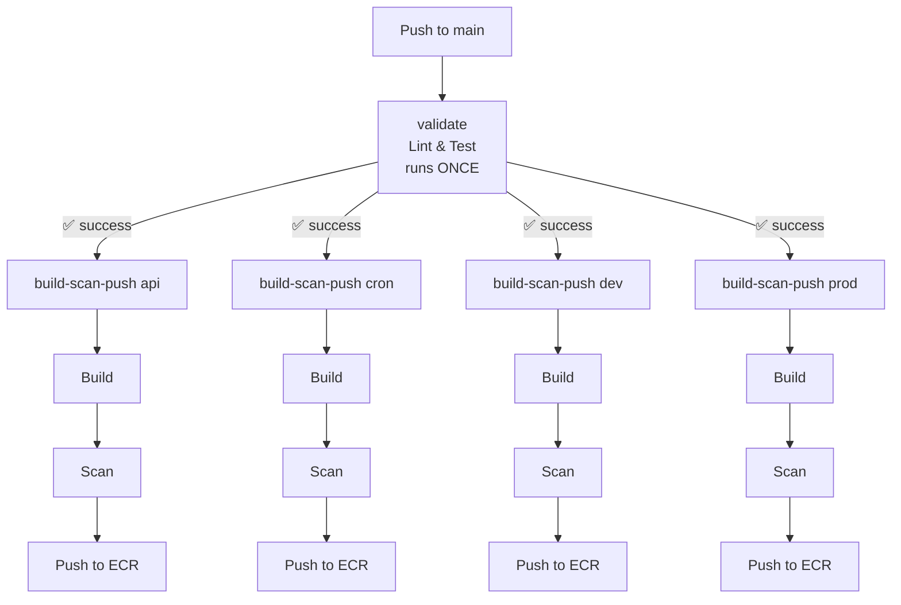

# CI — Gated Matrix Publish

Automated pipeline to build, scan, and push Docker images to AWS ECR.

---

## Flow

---

## Jobs

### 1. `validate` (runs once)
- Installs dependencies
- Runs Prettier check
- Runs test suite
- **If this fails, nothing else runs**

### 2. `build-scan-push` (4 parallel matrix jobs)

| Step | Description |
|------|-------------|
| **Build** | Builds Docker image via Buildx |
| **Scan** | Scans image with Trivy (CRITICAL, HIGH) |
| **Push** | Pushes image to AWS ECR |

---

## Services

| Service | Dockerfile | ECR Repository |
|---------|------------|----------------|
| api | dockerfile/Dockerfile.api | `CR_REPOSITORY_API` |
| cron | dockerfile/Dockerfile.cron | `CR_REPOSITORY_CRON` |
| dev | dockerfile/Dockerfile.dev | `CR_REPOSITORY_DEV` |
| prod | dockerfile/Dockerfile.prod | `CR_REPOSITORY_PROD` |

---

## Secrets Required

| Secret | Description |
|--------|-------------|
| `AWS_ACCESS_KEY_ID` | AWS access key |
| `AWS_SECRET_ACCESS_KEY` | AWS secret key |
| `AWS_REGION` | AWS region |
| `CR_ENDPOINT` | ECR registry endpoint |
| `CR_REPOSITORY_API` | ECR repo name for api |
| `CR_REPOSITORY_CRON` | ECR repo name for cron |
| `CR_REPOSITORY_DEV` | ECR repo name for dev |
| `CR_REPOSITORY_PROD` | ECR repo name for prod |
