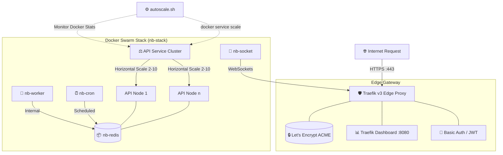

## 📋 Prerequisites (Before You Start)

| Requirement | Check | How to verify |
|-------------|-------|---------------|
| AWS Account | ⬜ | Have IAM Access Key & Secret |
| Domain Name | ⬜ | DNS accessible (e.g., `yourcompany.com`) |
| ECR Images | ⬜ | 4 images pushed: api, worker, cron, socket |
| EC2 Instance | ⬜ | Ubuntu 22.04, t3.medium+, ports 80/443 open |
| Local Machine | ⬜ | SSH key to access EC2 |

## ✅ Deployment Checklist (Print this!)

Before deploying, verify these:

- [ ] EC2 security group has ports 80, 443, 22 open
- [ ] Domain DNS points to EC2 IP (A records)
- [ ] `.env` file has correct DOMAIN and EMAIL
- [ ] AWS CLI configured (`aws configure`)
- [ ] Logged into ECR (`aws ecr login`)
- [ ] Docker Swarm initialized (`docker swarm init`)

**When all boxes are checked → run `./deploy.sh`**

# 🚀 Nitroberry DevOps - Production Orchestration & Scaling

[](https://docs.docker.com/engine/swarm/)
[](https://doc.traefik.io/traefik/)
[](https://letsencrypt.org/)
[](https://github.com/features/actions)

This repository serves as the definitive infrastructure-as-code (IaC) layer for **Nitroberry**. It leverages **Docker Swarm** for container orchestration, **Traefik v3** as a dynamic edge proxy with automated SSL, and a custom **Shell-based Auto-Scaling Engine** to ensure high availability and resource efficiency.

---

## 🏗️ System Architecture

The Nitroberry stack is designed for extreme resilience and performance. Below is the technical visualization of the traffic flow and internal service connectivity.



---

## 🚦 Traffic & Load Balancing

Traefik acts as the intelligent entry point, automatically discovering services via the **Docker Engine API**.

1.  **Round Robin Distribution**: Inbound requests to `${DOMAIN}` are balanced across all healthy `nb-api` replicas.
2.  **SSL Termination**: Traefik automatically negotiates and renews TLS certificates via Let's Encrypt (HTTP-01 challenge).
3.  **Self-healing**: Container failures are detected instantly; Traefik stops routing to unhealthy nodes without downtime.
4.  **WebSocket Support**: Optimized path for `socket.${DOMAIN}` connecting directly to the `nb-socket` service.
5.  **Edge JWT Validation**: Traefik intercepts all requests to protected routes, validates the JWT signature/expiry, and forwards user claims to the backend.

---

## 🔐 Edge JWT Authentication

The Nitroberry stack offloads authentication from the backend services to the Traefik Gateway using a specialized middleware plugin.

### How it Works:
- **Public Routes**: `/login`, `/health`, and `/api/public/*` are accessible without a token.
- **Protected Routes**: All other routes require a valid `Authorization: Bearer <token>` header.
- **Claim Forwarding**: Once validated, Traefik injects the following headers into the request before it reaches the backend:
    - `X-User-ID`: From the `sub` claim.
    - `X-User-Email`: From the `email` claim.
    - `X-User-Roles`: From the `roles` claim.

> [!IMPORTANT]
> Your backend APIs no longer need to verify JWT tokens manually. They should trust the `X-User-*` headers injected by Traefik.

---

## ⚙️ Service Catalog

| Service | Role | Image Source | Scaling |
| :--- | :--- | :--- | :--- |
| **`traefik`** | Edge Proxy / SSL | `traefik:v3.0` | Fixed (1) |
| **`nb-api`** | Core Application | `${CR_REGISTRY}/nb-api` | **Dynamic (2-10)** |
| **`nb-socket`** | Real-time Engine | `${CR_REGISTRY}/nb-socket` | Fixed (1) |
| **`nb-worker`** | Task Processor | `${CR_REGISTRY}/nb-worker` | Fixed (1) |
| **`nb-cron`** | Scheduler | `${CR_REGISTRY}/nb-cron` | Fixed (1) |
| **`nb-redis`** | Shared Cache / Bus | `redis:8-alpine` | Fixed (1) |

---

## 📈 Auto-Scaling Engine (`autoscale.sh`)

The `nb-api` service is equipped with an automated scaling script that monitors container load in real-time.

> [!TIP]
> **Scaling Logic:**
> - **Threshold**: 70% CPU Average.
> - **Action (UP)**: Adds +1 replica if `< 10` total.
> - **Threshold**: 30% CPU Average.
> - **Action (DOWN)**: Removes -1 replica if `> API_REPLICAS` (Baseline).
> - **Cooldown**: 60 seconds between operations to prevent flapping.

**Usage:**
```bash
./autoscale.sh # Run in foreground to monitor
# OR
nohup ./autoscale.sh > autoscale.log 2>&1 & # Run in background
```

---

## 🚀 Step-by-Step EC2 Deployment Guide (High Level)

This guide is designed to help a beginner set up the entire stack from scratch on a fresh AWS EC2 instance.

### Phase 1: EC2 Instance Preparation
1.  **Launch Instance**: Use **Ubuntu 22.04 LTS** (t3.medium or higher recommended).
2.  **Security Group**: Open ports **80 (HTTP)**, **443 (HTTPS)**, and **22 (SSH)** to the world.
3.  **Install Docker**:
    ```bash
    curl -fsSL https://get.docker.com -o get-docker.sh
    sudo sh get-docker.sh
    sudo usermod -aG docker $USER
    newgrp docker
    ```

## ✅ After Successful Deployment

You will have:

| Component | URL | Credentials |
|-----------|-----|-------------|
| **API** | `https://api.yourdomain.com` | Public |
| **Traefik Dashboard** | `https://traefik.yourdomain.com` | admin / your-password |
| **Grafana** | `https://grafana.yourdomain.com` | admin / admin |
| **Socket** | `wss://socket.yourdomain.com` | Public |

**Container Count:** 7 (idle) to 15 (peak)

### Phase 2: Initialize Docker Swarm
This command initializes the orchestration engine. It only needs to be run **once** per cluster.
```bash
docker swarm init
```

### Phase 3: AWS ECR Authentication
Since your images are stored in a private registry, you must authenticate your EC2 instance.
1.  **Install AWS CLI**: `sudo apt install awscli -y`
2.  **Configure Credentials**: `aws configure` (Enter your IAM Access Key & Secret).
3.  **Login to Registry**:
    ```bash
    # Replace the URL with your actual CR_REGISTRY from .env
    aws ecr get-login-password --region your-region | docker login --username AWS --password-stdin your-account-id.dkr.ecr.your-region.amazonaws.com
    ```

### Phase 4: Environment & App Configuration
1.  **Clone the Repository**: `git clone <your-repo-url> && cd Nitroberry_DevOps_CICD`
2.  **Setup Environment Variables**:
    ```bash
    cp .env.template .env
    nano .env
    ```
    **Critical `.env` Variables to Update:**
    - `CR_REGISTRY`: Your full ECR URL (e.g., `123456789.dkr.ecr.us-east-1.amazonaws.com`).
    - `DOMAIN`: Your base domain (e.g., `nitroberry.com`).
    - `LETSENCRYPT_EMAIL`: Your email for SSL notifications.
    - `REDIS_PASSWORD`: A random secure string.
    - `JWT_SECRET`: The symmetric key used to sign your HS256 tokens.
    - `JWT_AUDIENCE`: Expected audience (default: `nitroberry-api`).

### Phase 5: Launch the Stack
Run the automated deployment script. It handles network creation and stack deployment.
```bash
chmod +x deploy.sh autoscale.sh
./deploy.sh
```

### Phase 6: Start the Auto-Scaler
Keep your API responsive by starting the background scaling engine.
```bash
nohup ./autoscale.sh > autoscale.log 2>&1 &
```

---

## 🔁 Management Reference

| Task | Command |
| :--- | :--- |
| **Check Stack Status** | `docker stack services nb-stack` |
| **View Service Health** | `docker service ps nb-stack_nb-api` |
| **View Real-time Logs** | `docker service logs -f nb-stack_nb-api` |
| **Force Restart Service** | `docker service update --force nb-stack_nb-api` |
| **Traefik Dashboard** | `https://traefik.${DOMAIN}` (Auth Required) |


## 🛠️ Troubleshooting for Freshers

| Error Message | Why it happens | Fix |
|---------------|----------------|-----|
| `No such image` | Not logged into ECR | Run `aws ecr login` command |
| `404 page not found` | Domain not set or DNS not propagated | Wait 5-10 minutes, check `.env` |
| `401 Unauthorized` | Wrong dashboard password | Check `TRAEFIK_AUTH` in `.env` |
| `0/2 replicas` | Images not pulled or wrong version | Check ECR for correct tags |
| `certificate error` | SSL not issued yet | Wait 2-3 minutes, check email |
| `port 8080 refused` | Traefik not running | Run `docker service ps nb-stack_traefik` |
| `401 Unauthorized (JWT)` | Invalid or missing token | Check `JWT_SECRET` in `.env` or token expiry |
| `403 Forbidden` | Expired or invalid claims | Ensure token has correct `aud` and `iss` claims |
---
*Maintained by Nitroberry DevOps Team*