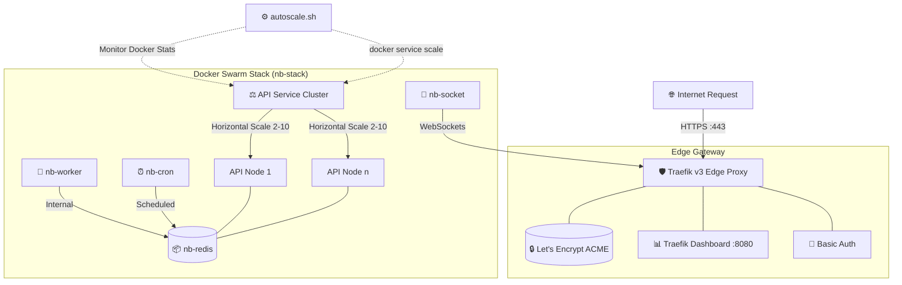

# 🚀 Nitroberry DevOps - Production Orchestration & Scaling

[](https://docs.docker.com/engine/swarm/)
[](https://doc.traefik.io/traefik/)
[](https://letsencrypt.org/)
[](https://github.com/features/actions)

This repository serves as the definitive infrastructure-as-code (IaC) layer for **Nitroberry**. It leverages **Docker Swarm** for container orchestration, **Traefik v3** as a dynamic edge proxy with automated SSL, and a custom **Shell-based Auto-Scaling Engine** to ensure high availability and resource efficiency.

---

## 🏗️ System Architecture

The Nitroberry stack is designed for extreme resilience and performance. Below is the technical visualization of the traffic flow and internal service connectivity.



---

## 🚦 Traffic & Load Balancing

Traefik acts as the intelligent entry point, automatically discovering services via the **Docker Engine API**.

1.  **Round Robin Distribution**: Inbound requests to `${DOMAIN}` are balanced across all healthy `nb-api` replicas.
2.  **SSL Termination**: Traefik automatically negotiates and renews TLS certificates via Let's Encrypt (HTTP-01 challenge).
3.  **Self-healing**: Container failures are detected instantly; Traefik stops routing to unhealthy nodes without downtime.
4.  **WebSocket Support**: Optimized path for `socket.${DOMAIN}` connecting directly to the `nb-socket` service.

---

## ⚙️ Service Catalog

| Service | Role | Image Source | Scaling |
| :--- | :--- | :--- | :--- |
| **`traefik`** | Edge Proxy / SSL | `traefik:v3.0` | Fixed (1) |
| **`nb-api`** | Core Application | `${CR_REGISTRY}/nb-api` | **Dynamic (2-10)** |
| **`nb-socket`** | Real-time Engine | `${CR_REGISTRY}/nb-socket` | Fixed (1) |
| **`nb-worker`** | Task Processor | `${CR_REGISTRY}/nb-worker` | Fixed (1) |
| **`nb-cron`** | Scheduler | `${CR_REGISTRY}/nb-cron` | Fixed (1) |
| **`nb-redis`** | Shared Cache / Bus | `redis:8-alpine` | Fixed (1) |

---

## 📈 Auto-Scaling Engine (`autoscale.sh`)

The `nb-api` service is equipped with an automated scaling script that monitors container load in real-time.

> [!TIP]
> **Scaling Logic:**
> - **Threshold**: 70% CPU Average.
> - **Action (UP)**: Adds +1 replica if `< 10` total.
> - **Threshold**: 30% CPU Average.
> - **Action (DOWN)**: Removes -1 replica if `> API_REPLICAS` (Baseline).
> - **Cooldown**: 60 seconds between operations to prevent flapping.

**Usage:**
```bash
./autoscale.sh # Run in foreground to monitor
# OR
nohup ./autoscale.sh > autoscale.log 2>&1 & # Run in background
```

---

## 🛠️ Deployment & Maintenance

### 1. Prerequisites
- Docker Engine (Swarm Mode enabled: `docker swarm init`).
- AWS ECR Registry (Authenticated: `aws ecr login`).
- Port 80 and 443 open in Security Groups.

### 2. Environment Configuration
Populate `.env` with your specific production values:
```bash
cp .env.template .env
nano .env # Set DOMAIN, LETSENCRYPT_EMAIL, CR_REGISTRY, etc.
```

### 3. Execution
```bash
chmod +x deploy.sh autoscale.sh
./deploy.sh
```

---

## 🧪 CI/CD Pipeline

The stack is integrated with **GitHub Actions** for a full GitOps workflow:

- **Lint & Test**: Every push triggers Prettier and unit tests.
- **Security Scan**: `aquasecurity/trivy` scans every API image for vulnerabilities before pushing.
- **Matrix Builds**: Parallel builds for multiple services (`api`, `cron`, `dev`, `prod`).
- **Auto-Tagging**: Semantic versioning logic (e.g., `0.0.0.X`) managed by ECR image descriptions.

---

## 🔁 Management Reference

| Task | Command |
| :--- | :--- |
| **Check Stack Status** | `docker stack services nb-stack` |
| **View Service Health** | `docker service ps nb-stack_nb-api` |
| **View Real-time Logs** | `docker service logs -f nb-stack_nb-api` |
| **Force Restart Service** | `docker service update --force nb-stack_nb-api` |
| **Traefik Dashboard** | `https://traefik.${DOMAIN}` (Auth Required) |

---
*Maintained by Nitroberry DevOps Team*