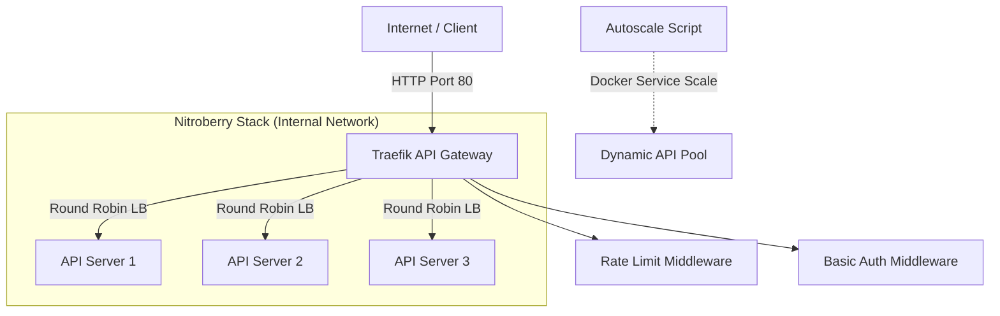

# Nitroberry DevOps CI/CD - Traefik API Gateway Stack


## 🚀 Project Overview
**Nitroberry_DevOps_CICD** is a production-grade API gateway implementation using **Traefik** to replace traditional Nginx setups. This project provides a robust foundation for modern microservices with:

*   **API Gateway & Load Balancing**: Traefik intelligently routes traffic and balances load across multiple API containers.
*   **Security & Auth**: Built-in Basic Auth and Rate Limiting middlewares.
*   **Performance**: Horizontal auto-scaling based on real-time CPU usage.
*   **Environment Agnostic**: Tested on both AWS EC2 and Azure VMs.
*   **Observervability**: Integrated monitoring support (Grafana/Prometheus).

---

## 🏗️ Architecture
The following diagram illustrates how Traefik handles incoming requests and distributes them across the API server fleet.



---

## 📋 Prerequisites
Before you begin, ensure you have the following:

- **Docker & Docker Compose**: Version 2.0+
- **Cloud CLI**: AWS CLI (for ECR) or Azure CLI (for ACR) if deploying custom images.
- **System Requirements**: 
  - Minimum: 2 vCPU, 4GB RAM.
  - Recommended: 4 vCPU, 8GB RAM (for autoscaling tests).

---

## ⚡ Quick Start
Get the stack up and running in minutes:

```bash
# 1. Clone the repository
git clone https://github.com/abhimanyu8829/Nitroberry_DevOps_CICD.git
cd Nitroberry_DevOps_CICD

# 2. Configure environment
cp .env.template .env
# Open .env and fill in your custom values (PUBLIC_IP, etc.)

# 3. Deploy the stack (Swarm mode recommended)
./deploy.sh
```
*Alternatively, for standard testing:* `docker-compose up -d`

---

## 🔁 How to Replace with Your Own API
Adapting this setup to your custom application is simple. Follow these steps to replace the test Nginx containers:

### **Step 1: Update docker-compose.yml**
Change the `image` field for `api1`, `api2`, and `api3` from `nginx:alpine` to your custom registry image.

```diff
-   image: nginx:alpine
+   image: your-account.dkr.ecr.us-east-1.amazonaws.com/nitroberry-api:latest
```

### **Step 2: Update Container Names**
If you rename the services in `docker-compose.yml`, ensure you also update the `dynamic.yml` references.

### **Step 3: Update dynamic.yml Servers**
Point the load balancer servers to your new container hostnames.

### **Step 4: Update Ports**
If your API runs on a different port (e.g., 3000), update the URL in `dynamic.yml`:
`url: http://api1:3000`

### **Step 5: Add Env Variables**
Add your app-specific environment variables in `docker-compose.yml`.

### **Step 6: Remove Nginx-specific commands**
Delete any `volumes` or `command` blocks used for creating custom index pages.

### **Example Configuration Change**
**Before:**
```yaml
api1:
  image: nginx:alpine
```
**After:**
```yaml
api1:
  image: 12345678.dkr.ecr.us-east-1.amazonaws.com/my-node-api:v1
  environment:
    - NODE_ENV=production
```

---

## ☁️ AWS Deployment (EC2)
1.  **Security Group**: Open port `80` (HTTP) and `8080` (Traefik dashboard).
2.  **ECR Auth**:
    ```bash
    aws ecr get-login-password --region us-east-1 | docker login --username AWS --password-stdin your-account.dkr.ecr.us-east-1.amazonaws.com
    ```
3.  **IAM Role**: Attach `AmazonEC2ContainerRegistryReadOnly` to the EC2 instance.
4.  **IP Config**: Update `PUBLIC_IP` in `.env` with the EC2 Public IP.

---

## 🟦 Azure Deployment (VM)
1.  **NSG Rules**: Add inbound security rules for ports `80` and `8080`.
2.  **ACR Auth**: `az acr login --name your_registry_name`
3.  **VM Sizing**: Recommended size `Standard_B2s` or higher.

---

## 🧪 Testing the Setup

### **Verify API & Load Balancing**
Run this loop to see the load balancer hitting different "servers":
```bash
for i in {1..10}; do curl -s http://localhost/ | grep Server; done
```

### **Test Rate Limiting**
Spam requests to trigger a `429 Too Many Requests` (requires configuration in `dynamic.yml`):
```bash
for i in {1..20}; do curl -I http://localhost/; done
```

### **Traefik Dashboard**
Access the web UI at `http://your-ip:8080` to monitor routing and health.

---

## 📈 Auto-Scaling
The project includes an `autoscale.sh` script that monitors CPU usage and scales the service.
- **Manual Scale**: `docker service scale nb-stack_nb-api=8`
- **Auto Scale**: Run `./autoscale.sh` to start the monitoring loop. It will scale between 4 and 10 replicas.

---

## ⚙️ Rate Limiting Configuration
Adjust the performance limits in `dynamic.yml`:
- **Average**: Number of requests allowed per second.
- **Burst**: Maximum volume of requests allowed at once.
- **Period**: Time window for the average.

---

## 🛠️ Monitoring & Troubleshooting

### **Useful Docker Commands**
```bash
docker stack services nb-stack    # Check service health
docker service logs -f nb-stack_traefik  # View gateway logs
docker stats                      # Watch CPU/Memory in real-time
```

### **Troubleshooting**
- **404 Not Found**: Ensure `Host` rule in `docker-compose.yml` matches your request.
- **Empty Reply**: Check if the containers are on the same bridge/overlay network.
- **Permission Denied**: Ensure `docker.sock` volume is correctly mounted.

---

## 🌍 Environment Variables
| Variable | Purpose | Example |
| :--- | :--- | :--- |
| `PUBLIC_IP` | Routing rules in Traefik | `44.219.100.191` |
| `CR_REGISTRY` | Container registry URL | `*.dkr.ecr.us-east-1.amazonaws.com` |
| `REDIS_PASSWORD` | App connectivity | `your-secure-pass` |

---
*Maintained by [Abhimanyu](https://github.com/abhimanyu8829)*
